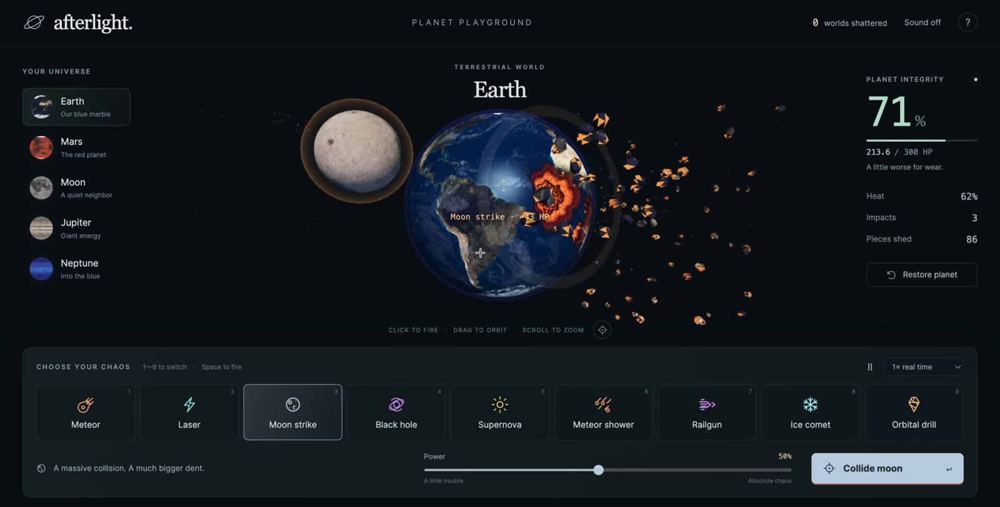

# Afterlight

**A tiny universe. Nine ways to wreck it.**

[Play in your browser](https://tokenmaxxing-ai.github.io/afterlight/) · [Report an issue](https://github.com/tokenmaxxing-ai/afterlight/issues)

Free to play. No install or account needed. Built with Three.js.

[](https://tokenmaxxing-ai.github.io/afterlight/)

A Three.js planet-destruction sandbox. Choose Earth, Mars, the Moon, Jupiter, or Neptune; aim at the surface; and combine nine distinct weapons. Damage accumulates until the planet breaks apart. A fatal black hole pulls fragments inward instead.

## Run locally

No build or package installation is required. All libraries and planet maps are served locally.

```sh
python3 -m http.server 4198 --directory dist
```

Open `http://localhost:4198`. WebGL is required.

## Controls

- Click or tap a planet to target that point. Drag to orbit; scroll or pinch to zoom.
- The launch button targets the planet's visible center.
- Select a tool with the buttons or keys 1–9. Space fires from the play area; P pauses and R restores.
- Adjust weapon power, pause physics, or watch at quarter speed.
- Restore clears all active effects and damage. Choosing another world starts it intact.
- Sound is optional and off by default. No accounts, purchases, or external requests are required by the game itself.

## Tougher worlds and weapon combos

Earth has 300 HP, Mars 260, the Moon 220, Jupiter 450, and Neptune 360. At 50% power a standard meteor does 21.6 HP of damage, so Earth can take fourteen ordinary hits. The integrity percentage always reflects the current world's actual health pool.

The original meteor, laser, moon strike, black hole and supernova are joined by:

- **Meteor shower:** five staggered projectiles scatter across the aimed area.
- **Railgun:** charges before releasing a concentrated shot.
- **Ice comet:** cools and frosts the crust. Follow it with a physical weapon to trigger extra shatter damage.
- **Orbital drill:** bores into one location with repeated damage pulses.

Freeze, then use a meteor, moon, shower, railgun or drill before the frost fades. Heat weapons and the black hole work independently of the ice combo. All delayed hits use simulation time, and restore cancels the entire sequence. New weapons have their own optional launch/impact sounds.

## The game effects

Meteors approach with hot trails and remove irregular pieces of crust. Strong impacts open holes with recessed walls and exposed hot material. The laser fires a focused cyan beam. Moon strikes create larger collisions. Black holes pull particles inward and absorb a destroyed world. A supernova radiates heat into the planet before breakup. A bounded pool of 144 textured 3D chips supports partial damage, alongside shockwaves and sparks. The final breakup releases 180 curved crust fragments around a molten core. “Pieces shed” counts the cumulative chips and fragments released since reset; older chips can fade or be absorbed.

This is fictional game physics. Health, frost and heat are game values rather than physical measurements. The worlds use similar display sizes; gas giants do not physically shatter into rocky crust. The original research-informed Earth timeline remains at `earth-timeline.html`.

## Source and credits

- `dist/sandbox.js`: interface, game controls, optional synthesized sound, and WebMCP tools.
- `dist/sandbox-scene.js`: Three.js rendering, targeting, impacts, effects, and destruction.
- `dist/sandbox.css`: responsive playground interface.
- `dist/assets/ASSET-CREDITS-PLANETS.md`: Solar System Scope / INOVE planet maps, CC BY 4.0.
- `dist/assets/ASSET-CREDITS.md`: Earth-map provenance and attribution.
- `dist/vendor/THREE-LICENSE.txt`: Three.js MIT license.

The renderer limits active effects, recent scars, 3D chips and particles, caps device pixel ratio at 1.5, respects reduced motion, and suspends frames when the document is hidden. Pause freezes effect motion while leaving camera navigation available. Browser model controls use `document.modelContext` when available, with a standard API fallback, and share the visible UI's state and validation.

## License

Original application code is released under the [MIT License](LICENSE). Vendored Three.js retains its own MIT license. Planet imagery retains its respective attribution and license; see [planet credits](dist/assets/ASSET-CREDITS-PLANETS.md) and [Earth credits](dist/assets/ASSET-CREDITS.md). The source-code license does not replace third-party asset licenses.

## Deploy your own copy

Fork this repository, enable GitHub Pages with **GitHub Actions** as the source, and run the Pages workflow. It publishes `dist/` directly; no build step or API keys are needed. Update the README play link to your fork.
